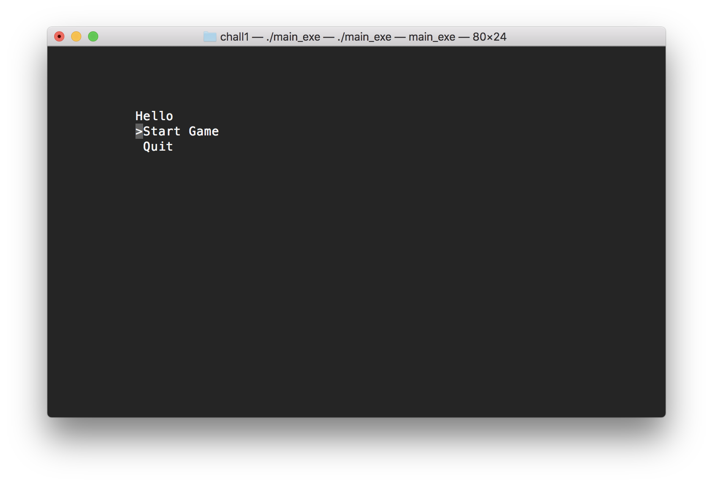
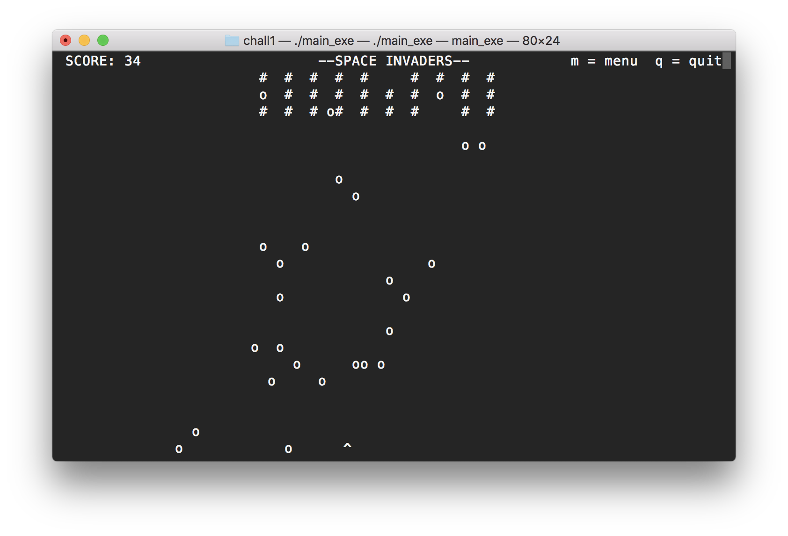
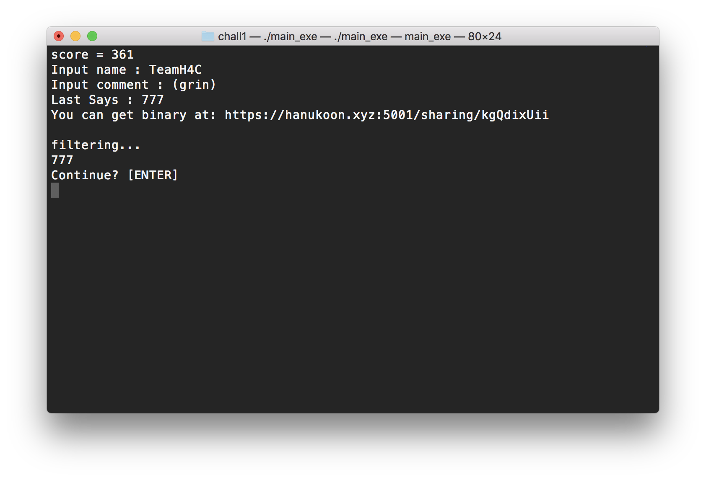
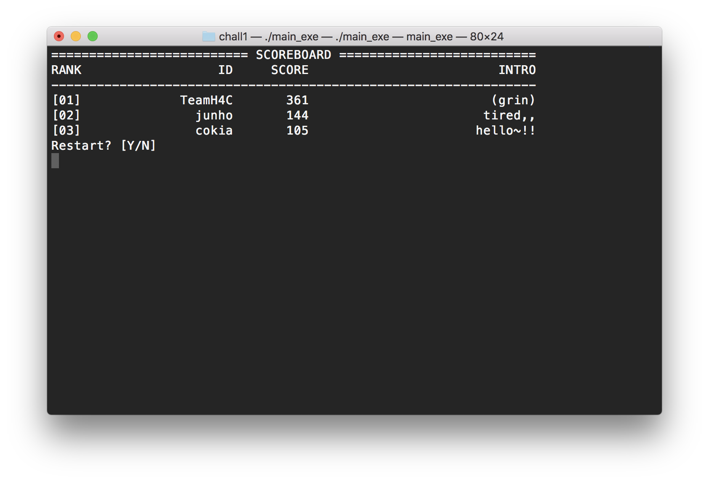

# Belluminar2018_chall1
[](https://travis-ci.com/cokia/Belluminar2018_chall1)

Belluminar 2018 Chall 1 

```
cd src
socat tcp-listen:3333,reuseaddr,fork,bind=0.0.0.0 exec:./main_exe 
```

# Prob Info
> H4C Late Student
> ----------
> kong,,kong,, 
>
> `nc {ip} {port}`

# 1. Gameplay

## 1-1. my_page


Press Up/Down to move the cursor and Enter key to choose

- `Start Game`: Starts the game
- `Quit`: Quit the program

## 1-2. game


https://github.com/flightcrank/space-invaders

- Left/Right keys to move spaceship(`^`)
- Space to shoot bullets(`*`) to enemy(alien) ships(`#`)
- `m` to open menu, `q` to quit game

## 1-3. input player info


Show final score and get input of player information

- `Input name`: player name to display in scoreboard
- `Input intro`: player intro to display in scoreboard
- `Last Says`: something to say(???)

Function `save_score` filters the string from the `Last Says` and execute as `system("echo " + string);`

The whitelisted chars are numbers(0~9), `/`, `'`, `;`, `x`, `$`

press Enter key to continue

## 1-4. scoreboard


Sorts records of gameplay from program startup by score and print infomation(name, score, intro)

- `Y`: Play game again
- `N`: Quit the program

# 2. exploit
- [Explanation](./exploit/README.md)
- [Python Script](./chall1/exploit.py)
